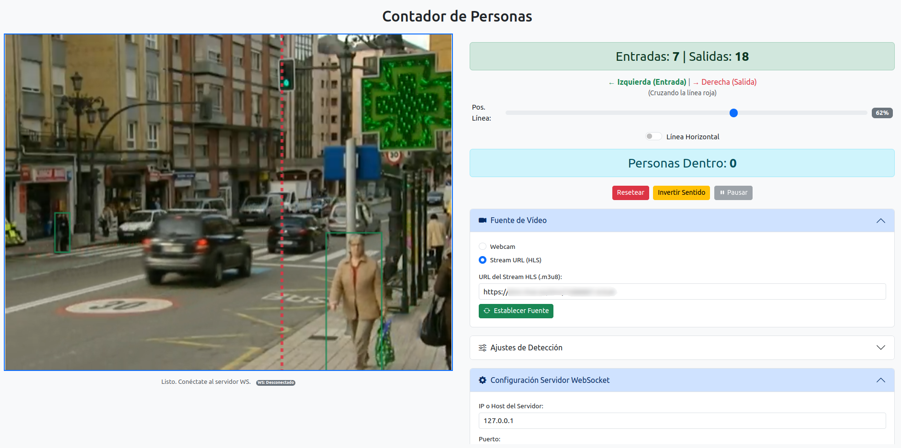

# JavaScript People Counter

[](https://opensource.org/licenses/MIT) [](https://soyunomas.github.io/javascript-people-counter/)

Una aplicación web para contar personas que cruzan una línea virtual usando la **webcam o un stream HLS** y TensorFlow.js, con opciones avanzadas de configuración y conexión WebSocket **opcional** para guardar capturas en un servidor realizado en python que se incluye. 🚶↔️

## 📝 Descripción Breve

Este proyecto utiliza la cámara web del navegador o una URL de stream HLS (.m3u8) y el modelo COCO-SSD de TensorFlow.js para detectar personas en tiempo real. Implementa una lógica de seguimiento básica basada en centroides para identificar cuándo una persona cruza una línea configurable (horizontal o vertical) en la pantalla, manteniendo contadores separados para "Entradas" y "Salidas".

Ofrece una interfaz con el vídeo/canvas a la izquierda y los controles/ajustes a la derecha (en pantallas grandes), incluyendo la configuración manual de la fuente de vídeo y la conexión **opcional** a un servidor WebSocket backend (`server.py`) para guardar imágenes en cada cruce detectado. Proporciona diversas opciones para ajustar el comportamiento de la detección y el conteo.

## 🖼️ Captura de Pantalla / Demo

*   Captura de pantalla mostrando el layout, detección de personas (rectángulos verdes), línea de cruce configurable y los controles/ajustes en accordions:

    

Puedes probar la demo en vivo aquí:

*   **[Demo - Probar Contador](https://soyunomas.github.io/javascript-people-counter/)**
*   **[Demo - Probar Contador para móvil (versión antigua)](https://soyunomas.github.io/javascript-people-counter/index_movil.html)**
*   **[Demo - Probar Contador mascotas Versión antigua (POC)](https://soyunomas.github.io/javascript-people-counter/index_mascotas.html)**

## ✨ Características Principales

*   **📹 Selección de Fuente de Vídeo:**
    *   Utiliza `navigator.mediaDevices.getUserMedia` para acceder al flujo de la **Webcam** (opción por defecto).
    *   Permite conectar a un **Stream HLS (.m3u8)** introduciendo su URL. Ideal para cámaras IP (requiere conversión RTSP->HLS previa) o streams públicos. Utiliza `hls.js` para compatibilidad.
*   **🤖 Detección en Tiempo Real:** Emplea **TensorFlow.js** y el modelo **COCO-SSD** preentrenado.
*   **💡 Detección de Cruce de Línea Flexible:**
    *   Identifica cruces a través de una línea virtual roja.
    *   **Orientación Configurable:** Permite cambiar entre línea **Vertical** u **Horizontal** mediante un interruptor.
    *   **Posición Ajustable:** Modifica la posición de la línea usando un slider (relativo al borde derecho/inferior).
*   **🕵️ Seguimiento Básico:** Intenta asignar un ID interno y seguir personas entre frames (basado en proximidad de centroide). *Nota: Los IDs no se visualizan en la interfaz.*
*   **📊 Contadores Detallados:**
    *   Contadores separados para **Entradas** y **Salidas**.
    *   Cálculo y display de **"Personas Dentro"** (neto).
*   **⚙️ Ajustes Avanzados (en Accordions):**
    *   **Fuente de Vídeo:** Selección entre Webcam y HLS URL con botón para aplicar.
    *   **Ajustes de Detección:**
        *   **Invertir Sentido:** Cambia fácilmente qué dirección cuenta como entrada o salida.
        *   **Umbral de Confianza:** Slider para filtrar detecciones por debajo de una confianza mínima.
        *   **Salto de Frames (Frame Skipping):** Slider para procesar la detección sólo cada N frames, optimizando rendimiento CPU.
        *   **Cooldown de Cruce:** Slider para definir un tiempo mínimo (ms) antes de re-contar a la misma persona si cruza repetidamente.
        *   **Ayuda Integrada:** Iconos de interrogación con popovers explicativos para cada ajuste de detección.
    *   **Configuración WebSocket:**
        *   Inputs para IP/Host y Puerto del servidor backend (con valores por defecto).
        *   Botón para **Conectar/Desconectar** manualmente la conexión WebSocket.
*   **🔌 Envío de Datos por WebSocket (Opcional):**
    *   Si está conectado al servidor WS, al detectar un cruce válido, envía un objeto JSON.
    *   El JSON contiene la dirección (`'IN'` o `'OUT'`) y la imagen del vídeo (sin overlays) en formato Base64 JPEG.
    *   Requiere el servidor WebSocket `server.py` (incluido) o uno compatible, escuchando en la IP/Puerto especificados.
*   **⏯️ Controles de Ejecución:**
    *   **Pausa/Reanudar:** Detiene/continúa el proceso de detección y seguimiento (requiere conexión WS activa y fuente de vídeo lista).
    *   **Resetear:** Pone a cero los contadores y limpia las pistas activas.
*   **💡 Feedback Visual:**
    *   Indicador claro de dirección Entrada/Salida (se adapta a orientación e inversión).
    *   El display de contadores parpadea brevemente al registrar un cruce.
    *   Indicador de estado de la conexión WebSocket.
*   **🖥️ Layout Responsivo:**
    *   Interfaz organizada con vídeo/canvas a la izquierda y controles/ajustes/configuración a la derecha en pantallas grandes.
    *   Se adapta a pantallas más pequeñas gracias a Bootstrap Grid.
*   **🎨 Interfaz con Bootstrap:** Usa Bootstrap 5 para layout, componentes (botones, sliders, alerts, accordions, popovers, switch) y utilidades.
*   **🧩 Código Autónomo:** Aplicación HTML completa en un único archivo (`index.html`) con CSS y JavaScript incrustados.

## 🛠️ Tecnologías Utilizadas

*   **HTML5:** Estructura semántica.
*   **CSS3:** Estilos personalizados, animaciones (flash), layout.
*   **Bootstrap 5.3.x:** Framework CSS/JS para layout, componentes y utilidades (cargado desde CDN).
*   **Bootstrap Icons:** Iconografía (cargada desde CDN).
*   **JavaScript (ES6+):** Lógica principal (Webcam API, HLS, TensorFlow.js, Tracking, DOM, WebSockets).
*   **TensorFlow.js Core (`@tensorflow/tfjs`):** Librería base de ML (cargada desde CDN).
*   **TensorFlow.js COCO-SSD Model (`@tensorflow-models/coco-ssd`):** Modelo preentrenado (cargado desde CDN).
*   **hls.js:** Librería para reproducir streams HLS (cargada desde CDN).
*   **Python 3 (para el servidor opcional):**
    *   **asyncio:** Para programación asíncrona.
    *   **websockets:** Librería para manejar conexiones WebSocket.
    *   **json:** Para parsear los datos recibidos.
    *   **base64:** Para decodificar las imágenes.
*   **CDNs:** Todas las librerías JS/CSS externas se cargan desde CDNs.

## 🚀 Instalación / Visualización Local

La aplicación web (`index.html`) es estática y funciona directamente en el navegador. El servidor Python (`server.py`) es **opcional** y solo necesario si deseas guardar las imágenes de los cruces.

1.  **Clona el repositorio:**
    ```bash
    git clone https://github.com/soyunomas/javascript-people-counter.git
    ```
2.  **Navega al directorio:**
    ```bash
    cd javascript-people-counter
    ```
3.  **Abre la aplicación web:**
    *   Abre `index.html` en tu navegador moderno (Chrome, Firefox, Edge, Safari recientes).
4.  **🌐 Conexión a Internet:** Necesaria para cargar librerías desde CDNs.
5.  **(Permisos):** Si usas la opción "Webcam", concede permiso a tu navegador para acceder a la cámara.
6.  **(Servidor Opcional):** Si quieres usar la funcionalidad de guardar imágenes, sigue las instrucciones de la sección "🐍 Servidor WebSocket Opcional".

## 🐍 Servidor WebSocket Opcional (`server.py`)

Este script Python actúa como un servidor WebSocket simple diseñado para recibir las capturas de imagen enviadas por la aplicación web (`index.html`) cada vez que se detecta un cruce de línea ('IN' o 'OUT').

**Funcionalidades:**

*   Escucha conexiones WebSocket entrantes en un `HOST` y `PORT` configurables.
*   Espera recibir mensajes en formato **JSON**.
*   Cada JSON debe contener:
    *   `direction`: Un string, ya sea `'IN'` o `'OUT'`.
    *   `imageData`: Un string que es un Data URL de imagen JPEG codificada en Base64 (`data:image/jpeg;base64,...`).
*   Decodifica la imagen Base64.
*   Guarda la imagen decodificada como un archivo `.jpg`.
*   El nombre del archivo sigue el formato: `img_YYYYMMDD_HHMMSS_ffffff_[IN|OUT].jpg` (ej. `img_20231116_153000_123456_IN.jpg`).
*   Las imágenes se guardan en un directorio configurable (`SAVE_DIR`, por defecto `received_images`). El directorio se crea si no existe.
*   Muestra logs básicos en la consola sobre conexiones, recepciones y guardado de archivos.

**Instalación y Ejecución (Linux - Debian/Ubuntu/Mint):**

1.  **Prerrequisito:** Asegúrate de tener **Python 3** instalado. Puedes verificarlo con `python3 --version`.
2.  **Navega al Directorio:** Abre una terminal y ve al directorio donde clonaste el repositorio (el mismo que contiene `server.py` e `index.html`).
3.  **Crea un Entorno Virtual (Recomendado):** Esto aísla las dependencias del proyecto.
    ```bash
    python3 -m venv venv
    ```
4.  **Activa el Entorno Virtual:**
    ```bash
    source venv/bin/activate
    ```
    (Tu prompt de terminal debería cambiar, indicando que estás dentro de `venv`).
5.  **Instala las Dependencias:** Solo se necesita la librería `websockets` **Atención la versión que me funciona a mi es la 12.0** Verifica la versión instalada y aumentala hasta que veas que funciona.
    ```bash
    pip install websockets==12.0
    ```
6.  **Ejecuta el Servidor:**
    ```bash
    python server.py
    ```
    Deberías ver mensajes indicando que el servidor se ha iniciado y está esperando conexiones.
7.  **Mantén la Terminal Abierta:** El servidor necesita seguir ejecutándose para recibir imágenes.
8.  **Para Detener el Servidor:** Vuelve a la terminal donde se está ejecutando y presiona `Ctrl + C`.
9.  **Desactiva el Entorno Virtual (cuando termines):**
    ```bash
    deactivate
    ```

**⚙️ Configuración del Servidor:**

Puedes cambiar el comportamiento del servidor editando las variables al inicio del archivo `server.py`:

*   `HOST`: La dirección IP en la que escuchará el servidor.
    *   `'0.0.0.0'` (por defecto): Escucha en todas las interfaces de red disponibles. Esto permite que la aplicación web se conecte desde la misma máquina (usando `127.0.0.1` o `localhost`) o desde otras máquinas en la misma red (usando la IP de red local del servidor).
    *   `'127.0.0.1'` o `'localhost'`: Escucha solo en la interfaz local. Solo permitirá conexiones desde la misma máquina.
*   `PORT`: El puerto TCP en el que escuchará el servidor (por defecto `8181`). **Asegúrate de que este puerto coincida con el configurado en la aplicación web (`index.html`)** en el accordion "Configuración Servidor WebSocket".
*   `SAVE_DIR`: El nombre del directorio donde se guardarán las imágenes recibidas (por defecto `'received_images'`).

**🔥 Nota sobre Firewall:** Si tienes un firewall activado en la máquina donde ejecutas `server.py`, asegúrate de permitir las conexiones entrantes en el puerto TCP configurado (por defecto `8181`).

## 🕹️ Cómo Usar la Aplicación Web

1.  **Inicio:** Abre `index.html`. Cargará el modelo y (por defecto) intentará iniciar la Webcam.
2.  **Seleccionar Fuente (Opcional):** Usa el accordion "**Fuente de Vídeo**" para elegir entre "Webcam" o "Stream URL (HLS)". Si es HLS, introduce la URL y pulsa "**Establecer Fuente**". Espera a que el vídeo comience a reproducirse.
3.  **Conectar WebSocket (Opcional):** Usa el accordion "**Configuración Servidor WebSocket**". Verifica/introduce la IP y Puerto del servidor (donde corre `server.py`) y pulsa "**Conectar...**". Si la conexión es exitosa, el botón cambiará a "**Desconectar WS**" y el indicador de estado se pondrá verde.
4.  **Visualización:** Verás el vídeo con la línea roja. Los rectángulos verdes indican personas detectadas (sin IDs).
5.  **Controles Principales:** Ajusta la línea (Posición, Orientación H/V), invierte el sentido si es necesario, pausa/reanuda (si WS está conectado y vídeo listo), o resetea los contadores.
6.  **Ajustes de Detección (Accordion):** Modifica la confianza, el salto de frames y el cooldown según tus necesidades.
7.  **Observar Estado:** Abajo a la izquierda verás el estado actual de la aplicación y de la conexión WS.

## ✅ TO-DO

-   [x] Añadir Fuente de video Stream URL (HLS)
-   [ ] Dibujar zona de detección además de la línea.

## 📄 Licencia

Este proyecto está bajo la Licencia MIT.
[](https://opensource.org/licenses/MIT)

## 🧑‍💻 Contacto

Creado por **soyunomas** ([@soyunomas en GitHub](https://github.com/soyunomas))

---
